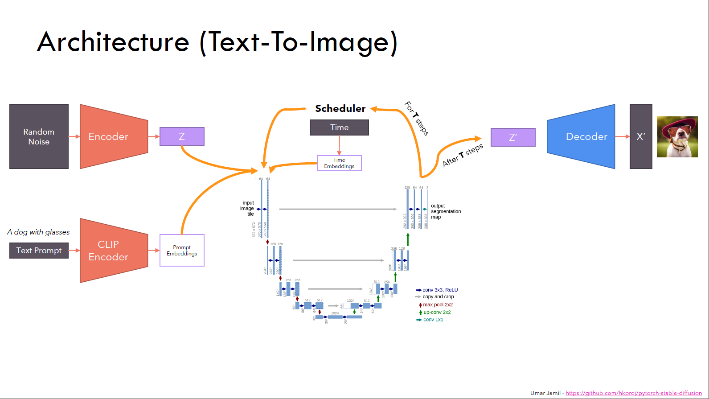
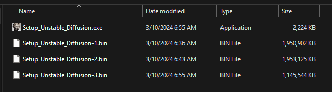
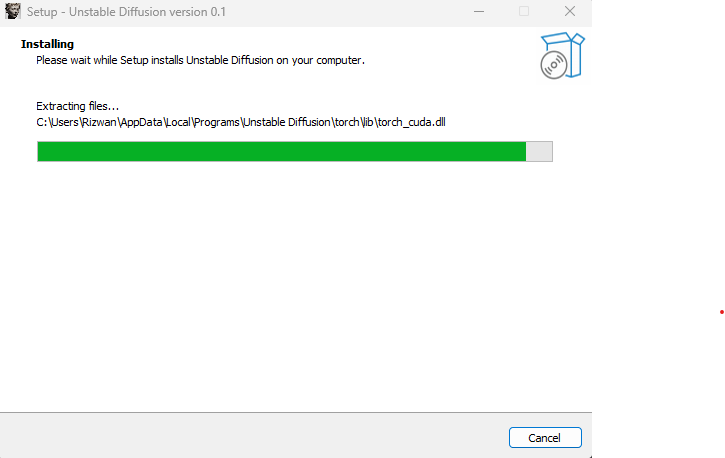

# Unstable Diffusion

This is RipOff version of Stable Diffusion with a desktop application on top. 
With this you can generate images from text prompt on your local machine. 

I have created this repo to learn generative AI and this source code is inspired by tutorials
and shit. 

## Table of Contents
- [Stable Diffusion - Architecture Overview](#Stable_Diffusion-Architecture)
- [Installation](#installation)
- [Usage](#usage)
- [Contributing](#contributing)
- [Credits](#credits)
- [Contact](#contact)

## Stable_Diffusion-Architecture

Text to Image architecture overview goes brrrrrrrrrrrrrrrrr

Image to Image architecture overview goes brrrrrrrrrrrrrrrrr

## Installation

Download Setup_Unstable_Diffusion.exe,Setup_Unstable_Diffusion-1.bin,
Setup_Unstable_Diffusion-2.bin and Setup_Unstable_Diffusion-3.bin from [here](https://iubat-my.sharepoint.com/:f:/g/personal/15303067_iubat_edu/En8i0MJhw6xDkV2Y7eBOA6UBSVdkIJk8GX_LE1ww7NglmA?e=r1o4pD)

Put those files in the same folder.
 
 
 
 

Then double click on Setup_Unstable_Diffusion.exe and install it just like a normal windows app.
The installation time may vary depending on your machine.

## Usage

Use this application to edit existing image with text prompt or generate image from scratch
with text prompts.

## Contributing

Riz1

## Credits

Thanks to all of you, those genius people who made Stable Diffusion real.
Special thanks to [Umar Jamil](https://www.youtube.com/@umarjamilai) from whom I've inspired to make it happen.

## Contact

For questions or feedback, you can reach me at [rizowan69@gmail.com](mailto:rizowan69@gmail.com).
Knock me if you want to contribute to this project.
Don't forget to visit my website to get more shit like this: [imrizo.github.io](https://imrizo.github.io/)

